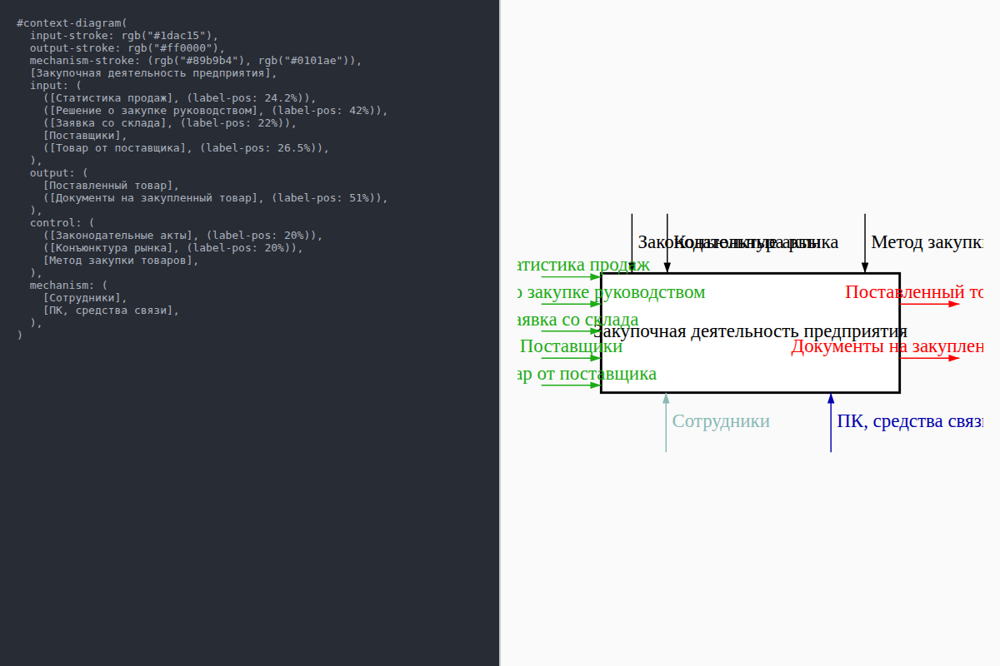
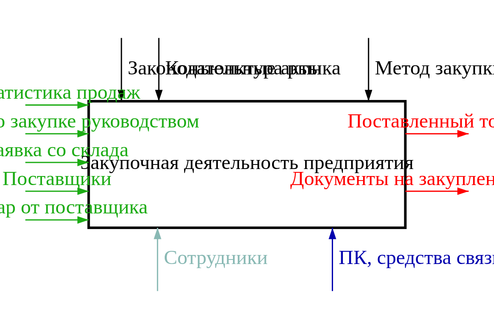
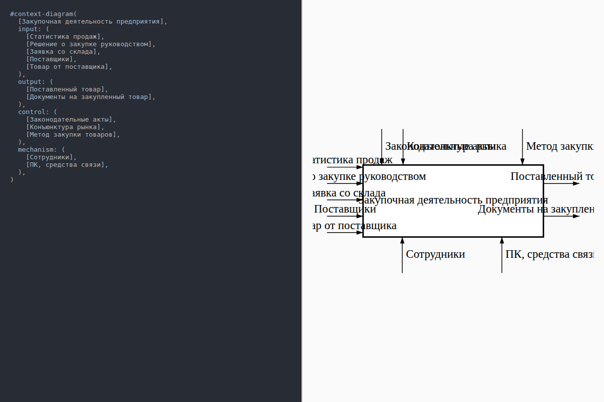
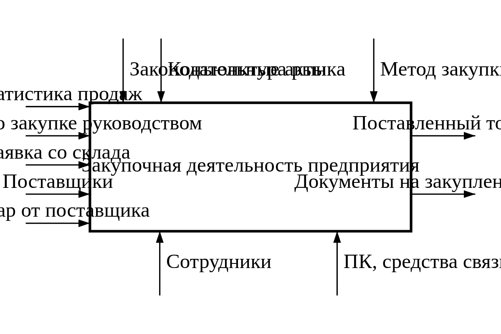
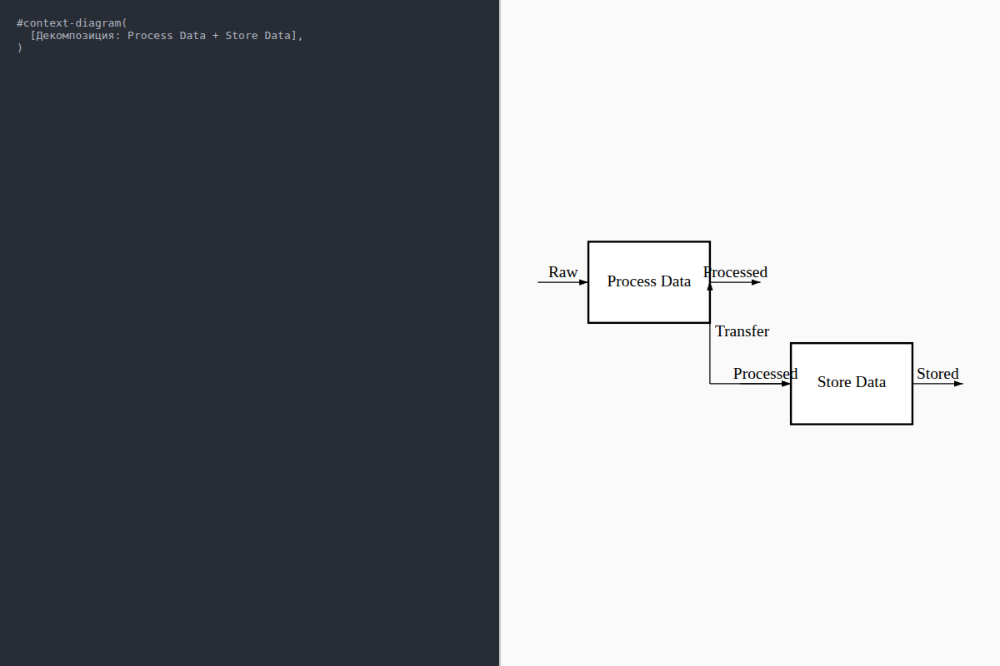
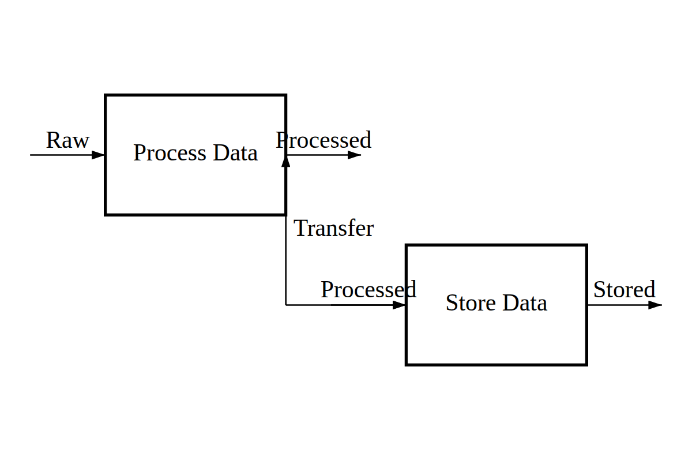

# IDEF0 SVG Diagram Generation in Common Lisp

This project ports a Typst IDEF0 generation engine to Common Lisp, rendering SVG output with node, ICOM routing, typography heuristics, and styling.

## Functional Tests & Outputs

As requested, below are the screenshots demonstrating the three functional tests, alongside their resulting SVG diagram screenshots.

### Pair 1: Styled Node Diagram
**Interface View (Typst Definition vs Result)**

**Diagram Result (SVG View)**

### Pair 2: Default Color Node Diagram
**Interface View (Typst Definition vs Result)**

**Diagram Result (SVG View)**

### Pair 3: Decomposition Network Diagram
**Interface View (Typst Definition vs Result)**

**Diagram Result (SVG View)**

## Test Coverage
Includes 10 positive unit tests and 10 negative unit tests enforcing error boundaries and checking edge connection logic.
